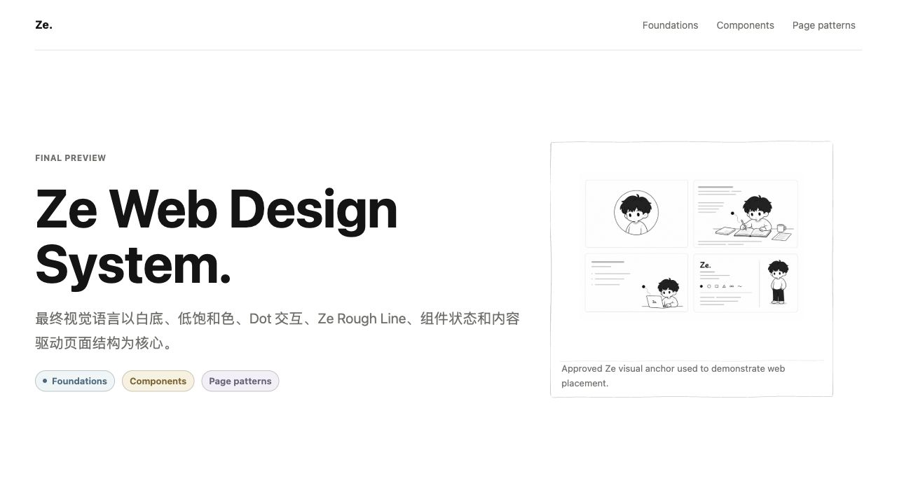

# Ze Design System

Reusable web design system and Codex skill for Zehao Li's personal IP, websites, writing pages, tools, and future web projects.

This repository is **not** the Portfolio implementation. Do not modify Portfolio or any other source project unless the user explicitly asks for implementation there.



## Current Status

Version: `v1.0.0-final-skill`

This repo contains the final skill package:

- `SKILL.md`: Codex skill entrypoint for Ze-style web design and HTML generation.
- `agents/openai.yaml`: UI metadata for the skill.
- `references/`: design-system source of truth.
- `gallery/`: static HTML preview of the final visual language.
- `assets/visual-anchors/approved/`: approved Ze Universe visual anchors.
- `assets/previews/`: README preview images.
- `scripts/generate-rough-lines.mjs`: deterministic rough-line SVG generator.
- `LICENSE`, `LICENSE-ZE-IP.md`, `NOTICE.md`: split licensing and attribution boundary.

## Preview

Open these files directly in a browser, or serve this folder with a static server:

- `gallery/index.html`: final gallery index.
- `gallery/style-tiles.html`: foundations, tokens, line language, motion, and approved anchors.
- `gallery/component-board.html`: component states, tabs, accordion, callouts, figures, and flows.
- `gallery/page-mockups.html`: final page patterns for Home, Article Detail, and Tool / Resource pages.

The gallery demonstrates reusable Ze web language. It is not production Portfolio code.

## Core Direction

- Calm but not flat.
- Minimal but not empty.
- Hand-drawn but not childish.
- Low-saturation color can support hierarchy, highlights, states, and local meaning.
- Ze Universe symbols can support cursor, focus, hover, loading, and section markers.
- Ze character art appears only when it serves the concept, state, or action.
- Motion is a first-class design layer, but it must remain quiet and purposeful.
- White is the default canvas; color is local, low-saturation, and optional.

## Explicit Non-Goals

- Do not preserve the current Portfolio gray-green as a system color.
- Do not preserve the old retro-computer/window-like Portfolio article style.
- Do not turn Dot or other symbols into characters.
- Do not treat this repository as a one-off Portfolio redesign.

## Package Shape

Final release shape:

```text
ze-design-system/
├── SKILL.md
├── README.md
├── LICENSE
├── LICENSE-ZE-IP.md
├── NOTICE.md
├── agents/openai.yaml
├── references/
├── gallery/
├── assets/
│   ├── previews/
│   └── visual-anchors/
└── scripts/
```

## Licensing

Ze Design System uses split licensing:

- Reusable code, CSS, JavaScript, scripts, skill instructions, and non-IP documentation are MIT licensed. See `LICENSE`.
- Ze Universe IP assets, Ze character artwork, Dot/Symbol identity assets, generated Ze illustrations, and preview images containing Ze are not MIT licensed. See `LICENSE-ZE-IP.md`.
- External design-system inspirations and license notes are listed in `NOTICE.md`. No upstream code, components, screenshots, templates, or visual assets are vendored here.

Publish target: independent GitHub repository.
